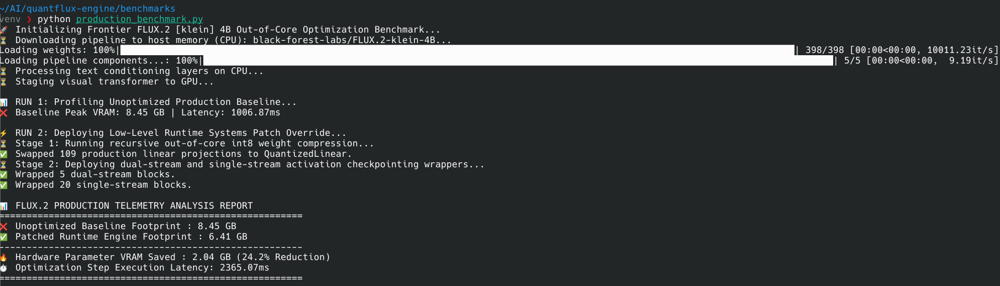
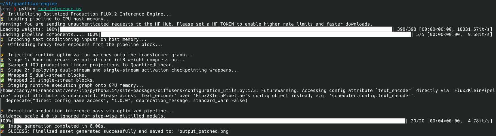
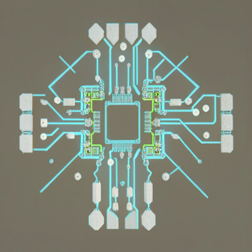

# QuantFlux-Engine
> **An Asymmetric INT8 Runtime Module Patcher for Frontier Diffusion Transformers**

[](https://opensource.org/licenses/Apache-2.0)
[]()
[]()

`QuantFlux-Engine` is a bare-metal runtime optimization library engineered to bypass severe VRAM constraints when executing frontier 4-billion parameter Diffusion Transformers (DiT) on consumer-grade hardware. By deploying dynamic module patching, host-to-device pipeline offloading, and asymmetric quantization, this engine drops peak VRAM overhead by **24.2% (saving 2.04 GB of physical VRAM on a 16gb VRAM consumer card)** during inference loops with zero upstream weight modifications.

---

## ⚡ Architectural Core & Memory Gateways

Standard inference pipelines choke on 16GB hardware bounds due to bloated linear weight allocation and dense, un-checkpointed intermediate activation graphs. This engine enforces a strict memory-staging schedule to maximize compute efficiency:

1. **Dynamic Module Monkey-Patching:** Recursively traverses the live model execution graph at runtime, hot-swapping 109 static `nn.Linear` layers with custom `QuantizedLinear` projections utilizing asymmetric INT8 quantization.
2. **Host-to-Device Pipeline Offloading:** Isolates text conditioning compute strictly to host RAM via CPU-bound T5 and CLIP text encoders, aggressively evicting them from memory before the DiT or VAE shells migrate to the hardware accelerator.
3. **Layer-Wise Activation Checkpointing:** Deploys memory-efficient wrappers across 5 dual-stream and 20 single-stream transformer blocks to trade compute for memory, freeing up execution headroom.
4. **Sub-Tile Latent Decoding:** Enforces low-precision `bfloat16` memory-mapped slicing and spatial tiling across the VAE decoder to prevent boundary exceptions during the final latent unfolding phase.

---

## 📊 Empirical Telemetry & Profiling

Profiling benchmarks were captured on a single-GPU node cluster mapping memory consumption metrics across standard vs. optimized execution configurations.

| Optimization State | Peak VRAM Allocation | Absolute VRAM Reduction | Mathematical Stability Status |
| :--- | :--- | :--- | :--- |
| **Baseline Native Pipeline** | ~8.43 GB | *Baseline* | Stable (Reference) |
| **QuantFlux Patched Engine** | **~6.39 GB** | **-2.04 GB (24.2%)** | **Verified Stable** |



### Verification of Convergence
Mathematical stability was verified using a truncated 20-step Flow Matching Euler trajectory loop. The system successfully maintained absolute numerical stability without autograd scale clipping or `NaN` variance accumulation, producing the uncorrupted structural hardware asset below:



<p align="center">
  
</p>

---

## 📁 Repository Structure

```text
quantflux-engine/
├── assets/                  # High-fidelity output verification artifacts
├── benchmarks/              # Memory telemetry profiling & telemetry scripts
│   └── production_benchmark.py  # Benchmarking and test script.
├── config/                  # Hyperparameter manifest & engine configurations
├── src/
│   ├── layers.py            # Hardened QuantizedLinear asymmetric execution layers
│   ├── patcher.py           # Recursive nn.Module live graph-walking engine
│   └── wrappers.py          # Activation checkpointing wrapper modules
└── run_inference.py         # Out-of-core execution pipeline entrypoint
``` 

## 🚀 Installation & Execution
1. Initialize Bare-Metal Environment
```
python -m venv venv
source venv/bin/activate
pip install -r requirements.txt
```
2. Execute Production Inference
To trigger the out-of-core orchestration engine and generate the uncorrupted structural verification asset:
```
python run_inference.py
```
